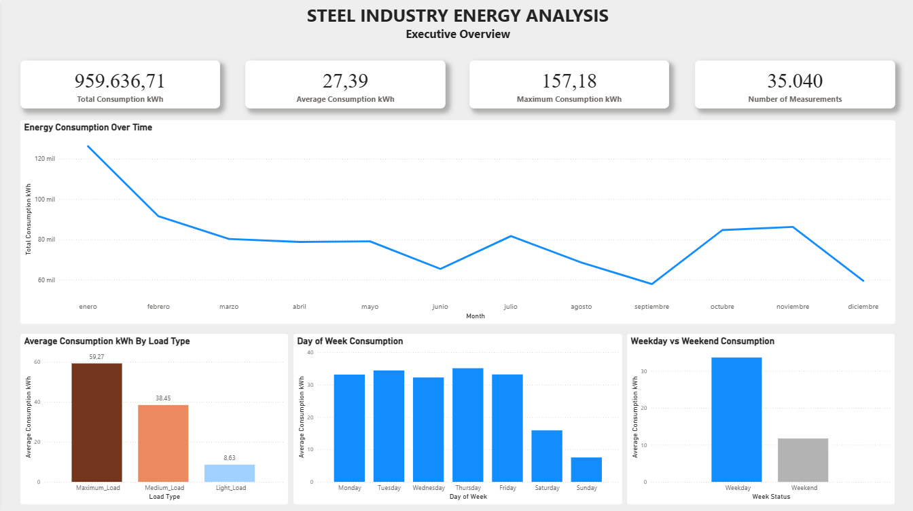
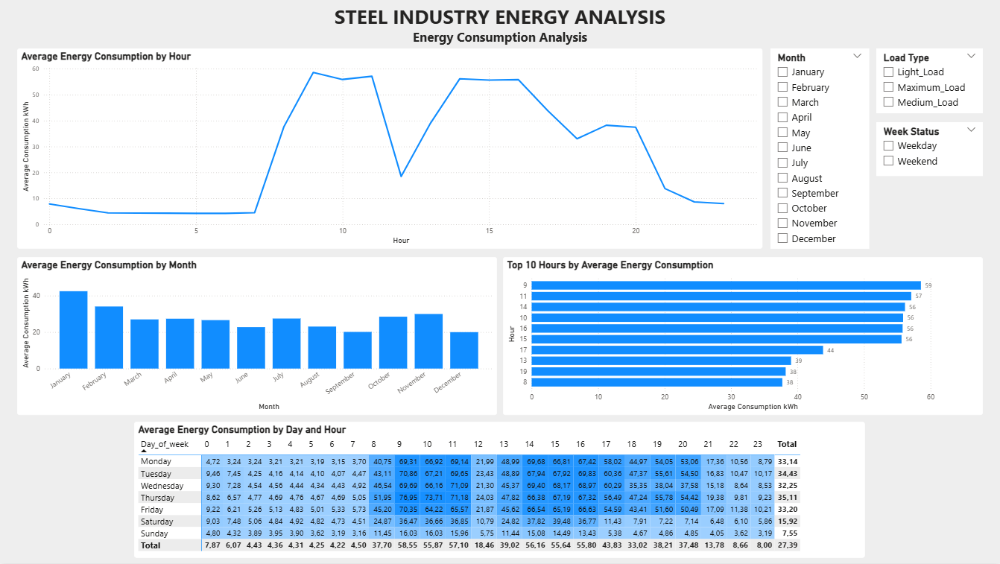
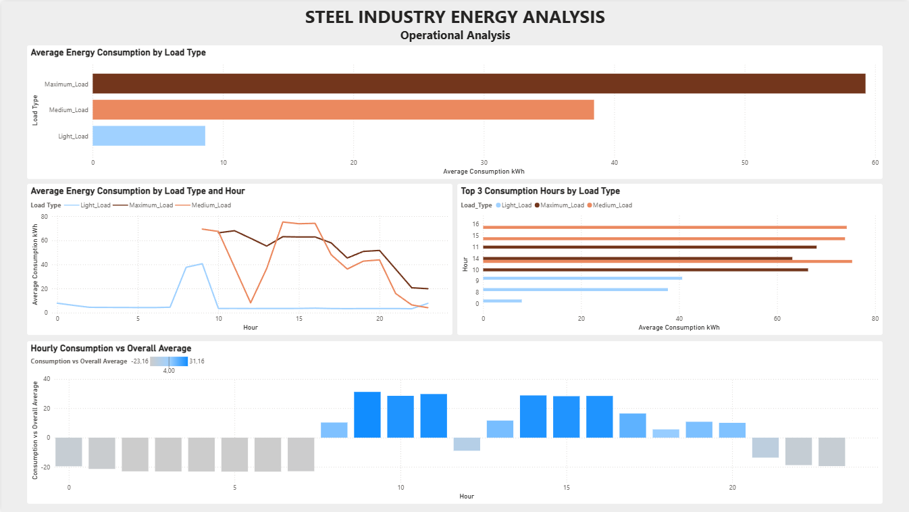

# Steel Industry Energy Consumption Analysis

End-to-end analysis of industrial energy consumption using **Python, MySQL and Power BI**.

The project combines data validation, exploratory data analysis, SQL business analysis and interactive dashboard development to identify energy consumption patterns across time, weekdays/weekends and load types.

---

## Dashboard

### Executive Overview



### Energy Consumption Analysis



### Operational Analysis



---

## Business Problem

Industrial energy consumption can vary significantly depending on the time of day, day of the week and type of electrical load.

The objective of this project is to analyze historical energy consumption data and identify relevant consumption patterns that can support operational analysis and business decision-making.

The analysis focuses on:

* Consumption patterns by hour.
* Consumption patterns by day and month.
* Weekday vs Weekend behavior.
* Energy consumption by load type.
* High-consumption periods.
* Operational patterns across different load types.

---

## Dataset

The dataset contains industrial energy consumption measurements collected throughout 2018.

| Attribute      |                         Value |
| -------------- | ----------------------------: |
| Records        |                        35,040 |
| Columns        |                            13 |
| Period         | January 1 – December 31, 2018 |
| Missing values |                             0 |
| Minimum Usage  |                      0.00 kWh |
| Maximum Usage  |                    157.18 kWh |
| Average Usage  |                 27.386892 kWh |
| Total Usage    |                959,636.71 kWh |

The project includes both the original dataset and the cleaned dataset used for the analysis.

---

## Project Workflow

```text
Raw Data
    │
    ▼
Python
Data validation + EDA + visualization
    │
    ▼
Clean Dataset
    │
    ├──────────────► MySQL
    │                Validation + exploratory analysis
    │                + business analysis
    │
    ▼
Power BI
Interactive dashboard + business analysis
    │
    ▼
GitHub
Project documentation and portfolio
```

---

# Python Analysis

Python was used for data loading, validation, exploratory data analysis and visualization.

### Main tasks

* Loaded the original CSV dataset.
* Converted the `date` column to datetime.
* Created `Hour` and `Month` variables.
* Validated the dataset structure.
* Generated descriptive statistics.
* Analyzed categorical variables.
* Checked missing values and duplicated records.
* Analyzed consumption by hour, day, week status, load type and month.
* Generated a correlation matrix.
* Created boxplots and heatmaps.
* Exported the cleaned dataset.

### Libraries

* Pandas
* Matplotlib
* Seaborn

The main Python script is available at:

```text
python/main.py
```

Generated charts are available in:

```text
outputs/charts/
```

---

# SQL Analysis

MySQL was used to validate the dataset and perform exploratory and business-oriented analysis.

### Database

```text
Database: steel_energy_analysis
Table: energy_data
Engine: MySQL 8.0
```

### Data Validation

The validation stage includes:

* Record count.
* NULL validation.
* Duplicate validation.
* Distinct categorical values.
* Date range validation.
* Minimum, maximum, average and total `Usage_kWh`.

### Exploratory Analysis

The exploratory SQL analysis includes:

* Average consumption by hour.
* Average consumption by day.
* Average consumption by month.
* Weekday vs Weekend comparison.
* Consumption by load type.
* Top 10 hours by average consumption.
* Consumption by hour and load type.
* Hours above the overall average.
* Consumption by day and hour.
* Top individual measurements.

### Business Analysis

Advanced SQL techniques were used to perform ranking and comparative analysis:

* CTE / `WITH`
* Subqueries
* `RANK()`
* `LAG()`
* `OVER()`
* `PARTITION BY`

These techniques were applied to:

* Rank load types.
* Rank consumption hours.
* Compare consumption with the previous hour.
* Rank hours within each load type.
* Identify the top 3 consumption hours by load type.
* Compare Weekday and Weekend consumption against the overall average.
* Rank days of the week.

SQL scripts are available in:

```text
sql/
```

---

# Power BI Dashboard

Power BI was used to transform the analytical results into an interactive business dashboard.

The report contains three pages.

## 1. Executive Overview

Provides a high-level view of energy consumption.

### KPIs

* Total Consumption
* Average Consumption
* Maximum Consumption
* Number of Measurements

### Visualizations

* Energy Consumption Over Time
* Average Consumption by Load Type
* Day of Week Consumption
* Weekday vs Weekend Consumption

---

## 2. Energy Consumption Analysis

Focuses on temporal consumption patterns.

### Visualizations

* Average Energy Consumption by Hour
* Average Energy Consumption by Month
* Top 10 Hours by Average Energy Consumption
* Average Energy Consumption by Day and Hour

### Filters

* Month
* Load Type
* Week Status

The Day × Hour matrix uses conditional formatting as a heatmap to facilitate the identification of consumption patterns.

---

## 3. Operational Analysis

Focuses on consumption behavior across load types and operating hours.

### Visualizations

* Average Energy Consumption by Load Type
* Average Energy Consumption by Load Type and Hour
* Top 3 Consumption Hours by Load Type
* Hourly Consumption vs Overall Average

The main Power BI results were cross-validated against the SQL analysis.

---

## Data Modeling & DAX

The Power BI report includes:

* DAX measures for key consumption indicators.
* Auxiliary tables for ordering days and months.
* Relationships between auxiliary tables and the main energy data table.
* Measures for Weekday vs Weekend analysis.
* Overall average comparisons.
* Load Type hourly rankings.

Main measures include:

* `Total Consumption`
* `Average Consumption`
* `Maximum Consumption`
* `Minimum Consumption`
* `Number of Measurements`
* `Average Consumption Weekday`
* `Average Consumption Weekend`
* `Weekday vs Weekend Ratio`
* `Overall Average Consumption`
* `Consumption vs Overall Average`
* `Hour Rank by Load Type`

---

# Key Analytical Areas

The project analyzes energy consumption from several business perspectives:

### Time-based analysis

Consumption was analyzed by:

* Hour
* Day of the week
* Month
* Day × Hour

### Operational analysis

Consumption was analyzed across:

* Light Load
* Medium Load
* Maximum Load

### Weekday vs Weekend

The project compares average consumption between weekdays and weekends and evaluates the relationship with the overall average consumption.

### Cross-validation

Results obtained through SQL were compared with the corresponding Power BI analysis to improve consistency between the analytical and visualization layers.

---

# Project Structure

```text
Steel-Industry-Energy-Analysis/
│
├── data/
│   ├── Steel_industry_data.csv
│   └── cleaned_energy_data.csv
│
├── python/
│   └── main.py
│
├── sql/
│   ├── 01_setup_database.sql
│   ├── 02_data_validation.sql
│   ├── 03_exploratory_analysis.sql
│   └── 04_business_analysis.sql
│
├── powerbi/
│   └── dashboard_energy.pbix
│
├── outputs/
│   └── charts/
│
├── screenshots/
│   ├── executive_overview.png
│   ├── energy_consumption_analysis.png
│   └── operational_analysis.png
│
└── README.md
```

---

# How to Reproduce the Analysis

## 1. Clone the repository

```bash
git clone https://github.com/JoseMoncayo01/steel-industry-energy-analysis.git
cd steel-industry-energy-analysis
```

## 2. Install Python dependencies

```bash
pip install pandas matplotlib seaborn
```

## 3. Run the Python analysis

```bash
python python/main.py
```

The script performs the exploratory analysis, generates the visualizations and exports the cleaned dataset.

## 4. Run the SQL scripts

Create the MySQL database using:

```text
sql/01_setup_database.sql
```

Then execute the remaining scripts in order:

```text
02_data_validation.sql
03_exploratory_analysis.sql
04_business_analysis.sql
```

## 5. Open the Power BI report

Open:

```text
powerbi/dashboard_energy.pbix
```

The report contains the three dashboard pages described above.

---

# Skills Demonstrated

This project demonstrates practical experience with:

* Data cleaning and validation
* Exploratory Data Analysis
* Data visualization
* Python
* Pandas
* SQL
* MySQL
* CTEs
* Window functions
* Ranking analysis
* Business-oriented data analysis
* Power BI
* DAX
* Data modeling
* Dashboard design
* Data storytelling
* Git
* GitHub

---

# Author

**Jose David Moncayo**

Data Analyst portfolio project focused on Python, SQL and Power BI.
